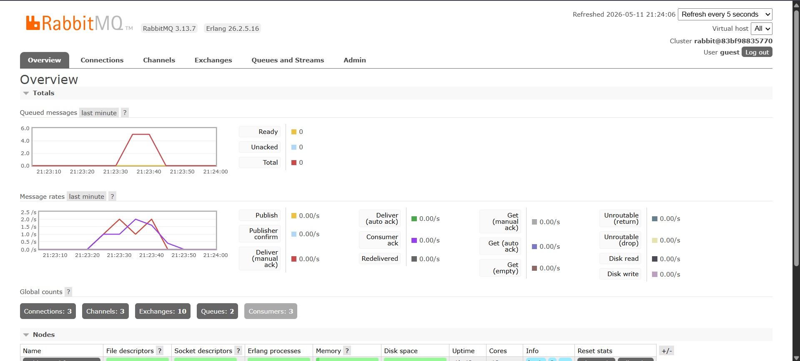

## Tutorial 9: Event-Driven Architecture (Subscriber)

**a. What is amqp?**
AMQP (*Advanced Message Queuing Protocol*) adalah protokol jaringan standar terbuka di tingkat aplikasi yang dirancang khusus untuk *message-oriented middleware*. Protokol ini mengatur bagaimana pesan dikirimkan secara aman, andal, dan efisien antara berbagai sistem atau aplikasi melalui sebuah *message broker*.

**b. What does it mean? `guest:guest@localhost:5672`, what is the first guest, and what is the second guest, and what is localhost:5672 is for?**
String tersebut merupakan URL koneksi yang digunakan oleh aplikasi untuk terhubung ke dalam *message broker* (RabbitMQ). Rinciannya adalah sebagai berikut:
- `guest` pertama adalah *username* *default* untuk login ke RabbitMQ.
- `guest` kedua adalah *password* *default* untuk *username* tersebut.
- `localhost` menandakan bahwa server RabbitMQ berjalan di komputer lokal (mesin yang sama dengan yang menjalankan kode ini).
- `5672` adalah *port* *default* yang didengarkan (listen) oleh RabbitMQ untuk menerima koneksi jaringan berprotokol AMQP.

## Queued Graph with Three Subscribers

Dengan menjalankan 3 *subscriber* secara bersamaan, lonjakan antrean menurun jauh lebih cepat dibandingkan saat hanya menggunakan 1 *subscriber*. Ini terjadi karena sistem sekarang menerapkan prinsip *load balancing*, di mana beban pemrosesan pesan dibagi secara merata kepada 3 *worker* (*subscriber*) yang berjalan serentak. Meskipun masing-masing *subscriber* memiliki *delay* lambat selama 1 detik per pesan, secara kolektif sistem kini dapat memproses 3 pesan sekaligus per detiknya.

## Reflection
Melihat kode saat ini, penggunaan `thread::sleep` untuk simulasi *delay* kurang ideal karena memblokir *thread*. Karena *project* ini menggunakan `tokio`, lebih baik menggunakan `tokio::time::sleep` yang bersifat *asynchronous* (non-blocking). Selain itu, data pada *publisher* saat ini masih di-*hardcode*, alangkah baiknya jika dibuat dinamis menerima *input* parameter.